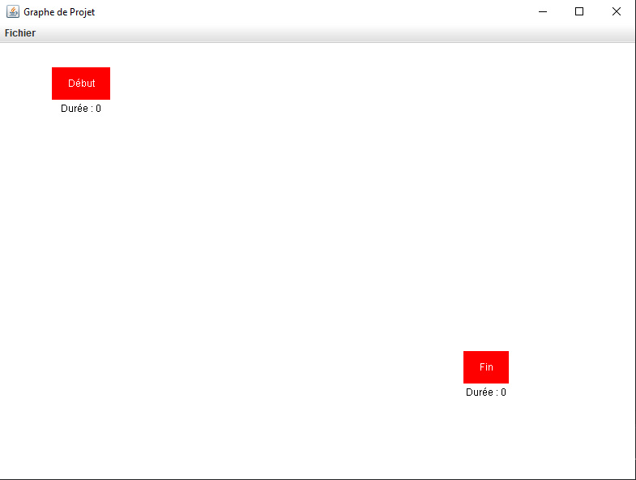
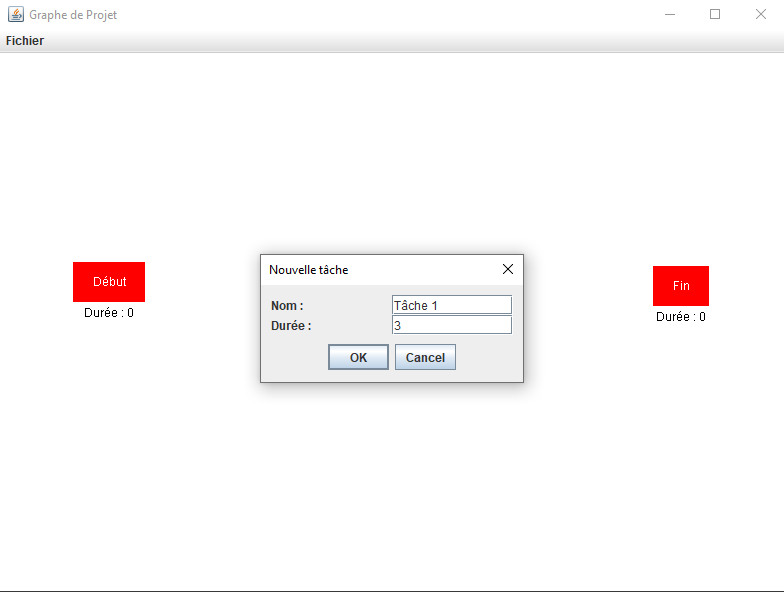
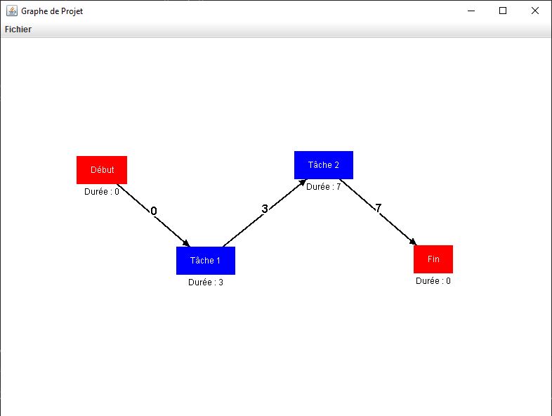

# GraphApp

A Java/Swing utility that lets you **draw, edit, and persist directed graphs** (tasks + arcs) through an intuitive drag-and-drop canvas.

## Features
* Add, delete, and modify **tasks** and **arcs** with one click.  
* Instant visual updates thanks to a custom `DrawingPanel`.  
* Save / load graphs to a simple text format for easy sharing.  
* Ships as a single runnable **JAR**—no installer required.

## Requirements
| Tool | Recommended version |
|------|---------------------|
| **Java JDK** | 17 or newer (byte-code is built for Java 8 to stay backward-compatible) :contentReference[oaicite:1]{index=1} |
| **OS** | Windows, macOS, or Linux |

## Run
Download and run the **GraphApp.jar** file

## Quick build (optionnal)

```cmd
:: inside the repo root
rd /s /q out 2>nul & md out                 :: clean output folder
for /R src %f in (*.java) do ^
    javac -encoding UTF-8 -source 1.8 -target 1.8 -d out "%f"
jar cfe GraphApp.jar view.MainWindow -C out .
```

## Screenshots




